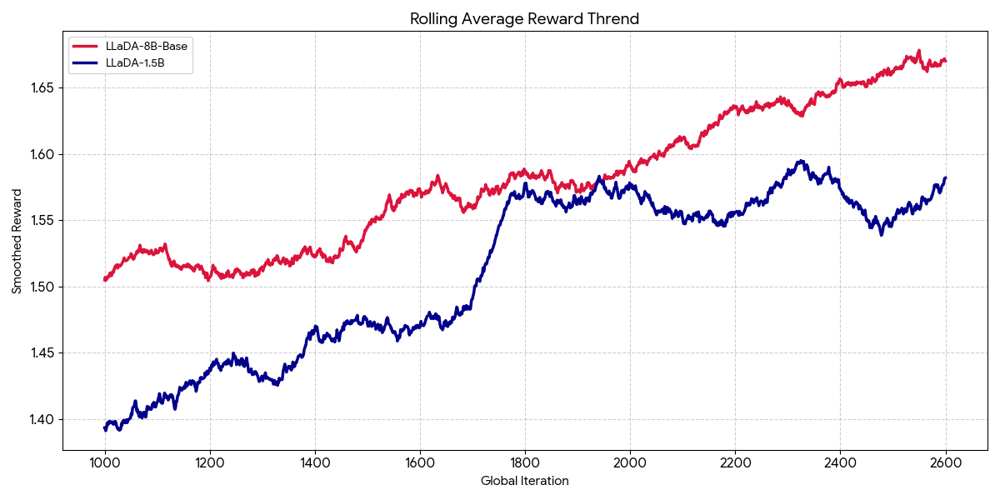

# Steering Diffusion Language Models via Policy Learning

We propose a policy-guided diffusion framework for language models, where the remasking process is learned instead of hand-designed. Diffusion-based language models generate sequences by iteratively predicting and remasking tokens, but existing approaches rely on fixed or heuristic strategies that are not optimized for task-specific objectives. We formulate remasking as a sequential decision-making problem, where a learned policy observes per-token features such as token identity, model confidence, entropy, and timestep, and decides which tokens to keep or remask at each step. The policy is trained using reinforcement learning to maximize global rewards, enabling improved constraint satisfaction and sample quality. Importantly, the underlying diffusion model remains frozen, and performance gains are achieved purely through inference-time control.

This repo runs a **policy-guided remasking** pipeline for Sudoku Solving Task (4x4):

1. Train a policy (`train_policy_sudoku.py`)  
2. Run sample inference (`policy_guided_remasking.py`)  
3. Evaluate policy-guided decoding vs low-confidence baseline (`eval.py`)

---

## Training Reward Curve




## Pipeline Scripts

- **Train + sample inference (SLURM):**  
  `policy_training/slurm_scripts/sudoku_policy_train_infer.sbatch`
- **Evaluation sweep (SLURM):**  
  `eval/run_eval.sh`

---

### Demonstration: Run policy training and Evaluation

````bash
srun --ntasks=1 --nodes=1 --output "${LOGDIR}/train_%j.out" \
  python -m accelerate.commands.launch \
    --config_file "${ACCEL_CONFIG}" \
    --multi_gpu \
    --num_processes "${NUM_GPUS}" \
    --main_process_port "${MAIN_PORT}" \
    train_policy_sudoku.py \
      --model_name "${MODEL_NAME}" \
      --train_csv "${TRAIN_CSV}" \
      --epochs "${EPOCHS}" \
      --batch_size "${BATCH_SIZE}" \
      --lr "${LR}" \
      --reverse_steps "${REVERSE_STEPS}" \
      --num_workers "${NUM_WORKERS}" \
      --seed "${SEED}" \
      --device cuda \
      --save_dir "${SAVE_DIR}"

CUDA_VISIBLE_DEVICES=$GPU_LIST python -m torch.distributed.run \
  --nproc_per_node $NUM_GPUS \
  --master_port $MASTER_PORT \
  eval.py \
  --dataset sudoku \
  --batch_size 8 \
  --gen_length 16 \
  --block_length 16 \
  --diffusion_steps $diffusion_steps \
  --sudoku_csv "$SUDOKU_CSV" \
  --policy_checkpoint_path "$policy_ckpt" \
  --remasking_strategy policy \
  --policy_reward_guided \
  --policy_reward_candidates 4 \
  --output_dir "eval_results" \
  --model_path "GSAI-ML/LLaDA-1.5"
